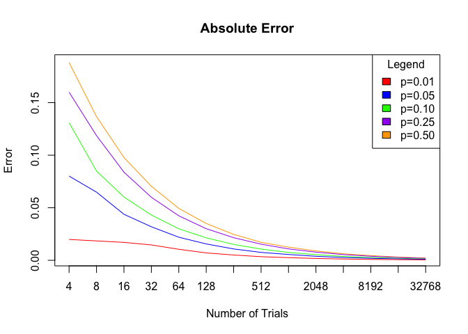
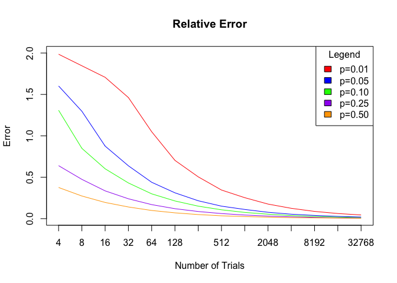

Monte Carlo Error
================

# Introdution

We can begin by thinking of this with a specific scenario, say a 10
sided die numbered 1 to 10. The actual probability of rolling a 1 is
.1,, yet in practice, it is possible to roll it 10 times and not have a
‘1’ be an outcome, this is the estimated probability. The estimated
probability is represented by p-hat, and the actual probability is
represented by p. The absolute error is the difference between the
estimated probability and actual probability, while the relative error
is the absolute error divided by the actual probability. The concept
behind the absolute error is that it will decrease as the number of
simulations increase- the more times you throw a die, the closer the
estimated error will be to the actual error.

# Methods

``` r
n=2^c(2:15)
p=c(0.01,0.05,0.1,0.25,0.5)
R=5000
abs.err = matrix(NA, nrow=length(p), ncol=length(n))
rel.err = matrix(NA, nrow=length(p), ncol=length(n))
for(i in 1:length(n)){
  for(j in 1:length(p)){
    phat = rbinom(R, n[i], p[j])/n[i]
    abs.err[j,i] = mean(abs(phat-p[j]))
    rel.err[j,i] = mean(abs(phat-p[j])/p[j])
  }
}
plot(x=log(n), y= abs.err[5,], xaxt='n', type="l", col="orange", main="Absolute Error", xlab = "Number of Trials", ylab = "Error")
axis(1, at= log(n),labels=n)
lines(x=log(n), y= abs.err[4,], col="purple")
lines(x=log(n), y= abs.err[3,], col="green")
lines(x=log(n), y= abs.err[2,], col="blue")
lines(x=log(n), y= abs.err[1,], col="red")
legend("topright", legend=c("p=0.01", "p=0.05", "p=0.10","p=0.25","p=0.50"), fill =c("red", "blue","green","purple","orange"), title="Legend", text.font=1)
```

<!-- -->

``` r
plot(x=log(n), y= rel.err[1,], xaxt='n', type="l", col="red", ylim=c(0,2), main="Relative Error", xlab = "Number of Trials", ylab = "Error")
axis(1, at= log(n),labels=n)
lines(x=log(n), y= rel.err[4,], col="purple")
lines(x=log(n), y= rel.err[3,], col="green")
lines(x=log(n), y= rel.err[2,], col="blue")
lines(x=log(n), y= rel.err[5,], col="orange")
legend("topright", legend=c("p=0.01", "p=0.05", "p=0.10","p=0.25","p=0.50"), fill =c("red", "blue","green","purple","orange"), title="Legend", text.font=1)
```

<!-- -->

# Interpertation

Estimated probability = p-hat Actual probability = p

Absolute error = p-hat - p,  
Relative error = absolute error/p

We see the absolute error decrease as the number of simulations
increase- the more times you throw a die, the closer the estimated error
will be to the actual error. And similarly, the relative error decrease
as the number of simulations increase.
