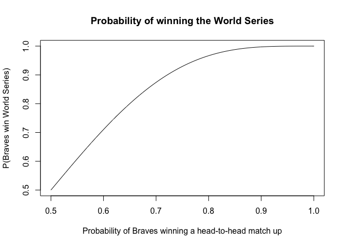
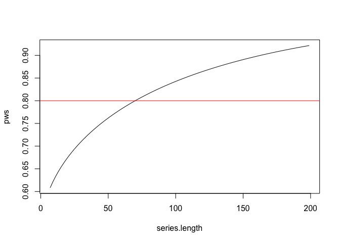
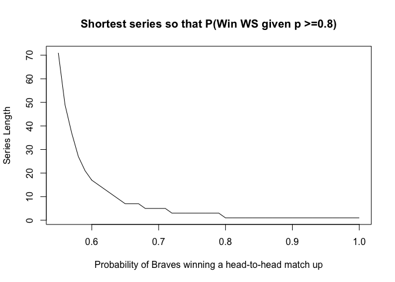

Discrete Probability Calculations
================

# Introduction

The Braves and the Yankees are competing in the World Series this year.
To win the World Series, a team must win best of 7 games, in any order
that may happen. For example, a team can win the first 4 games right off
the bat, or lose the first 3, then go on to win the next 4. Let P(y) be
the probability that the Yankees win 1 game (a head to head match up)
and P(b) be the probability that the Braves win 1 game. In this blog
post we will analyze the probability of the Braves winning the World
Series given various circumstances.

A concept to be familiar with prior is the Negative binomial
distribution. It is a discrete probability distribution that models the
number of successes in a sequence of independent and identically
distributed Bernoulli trials before a specified number of failures
occurs.

# Methods

1.  If P(Braves winning 1 game) = 0.55, then P(Yankees winning 1 game) =
    0.45. There are three ways to do this. First, the P(B win World
    Series) = P(4 games| P(b)=0.55) is represented below.

\[ = 0.55^4+ {4\choose 3} 0.55^4(1-0.55)+{5\choose 3} 0.55^4(1-0.55)^2+{6\choose 3} 0.55^4(1-0.55)^3 =0.6083\]
The first term represents the probability the Braves win the first 4
games. The second term represents the Braves winning in 5 games: 4
choose 3 determines which 3 of the first 4 games (because the 5th game
has to be a win, that outcome is already decided) the Braves win. We
then multiply it by (0.55)^4 because that is the probability of the
Braves winning 4 times, and then multiply it by (1-0.55) because that is
the probability that they lose once. The second term represents the
Braves winning in 6 games: 5 choose 3 determines which 3 of the first 5
games (because the 6th game has to be a win, that outcome is already
decided) the Braves win. We then multiply it by the respective
probabilities. The same process is repeated for when the Braves win in 7
total games.

The second way to do this is below by using R’s built in function
“dbinom”. An example of dbinom in use is: four coin flips with fair
coin (p(head) = .5). To calculate P(2 heads in 4 Flips) can be
calculated by dbinom(2, 4, .5).

``` r
#This is a binomial distribution
dbinom(3,6,0.55)*0.55+ #P(win 3 games out of 6 with the p(win 1 game)=0.55) and the 0.55 on the outside is the P of winning the 7th game)
  dbinom(3,5,0.55)*0.55+ 
  dbinom(3,4,0.55)*0.55+ 
  dbinom(3,3,0.55)*0.55 #P(win the first 3 games, the 0.55 on the outside is the P of winning the 4th game)
```

    ## [1] 0.6082878

Although we got the right answer, this may not be the most efficient. We
had to repeat the process 4 times accounting for each possibility.

The simplest way to calculate the probability is by using R’s built in
function “pnbinom”. The concept behind pnbinom is this: the probability
of getting 3 or less heads in 4 trials with a fair coin is pnbinom(3, 4,
.5). More generally, pnbinom is (\# of fails before the nth success,
total \# of successes, p of success).

``` r
pnbinom (3, 4, 0.55)
```

    ## [1] 0.6082878

2.  We will test different values of x from 0.5 to 1, increasing by
    0.001, and assign this to ‘x’.

<!-- end list -->

``` r
x <- seq(0.5, 1, by=0.001) 

win.prob <- pnbinom (3, 4, x)
```

``` r
plot(x, win.prob, main = "Probability of winning the World Series",
     xlab = "Probability of Braves winning a head-to-head match up",
     ylab = "P(Braves win World Series)",
     type = "l")
```

<!-- -->

3.  The Braves had a 0.6 probability of winning the World Series when
    playing best of 7. Perhaps, having more or less games in the series
    will increase their chances of winning the whole thing. We will see
    what the number is.

<!-- end list -->

``` r
pb=0.55 #Probability of winning 1 game
pws=0 #P(winning world series), set it to 0 because of the while loop later.
#Because we're starting at 7 games we set the values equal below. 
num.loss=3 
num.win=4

while(pws<0.8){ #keep running until pws hits 0.8. Running under assumption that we won't have an even # of games.
  num.loss = num.loss + 1 
  num.win = num.win + 1 #changing the total # of games in series
  
  pws = pnbinom(num.loss, num.win, 0.55) #running pnbinom each time num.loss/num.win change
}
num.loss + num.win #Will return the minimum series length.
```

    ## [1] 71

Below is another way to run the above code.

``` r
num.win = seq(4, 100, by=1)
num.loss = num.win - 1
pws = pnbinom(num.loss, num.win, 0.55)
series.length = num.win + num.loss

series.length[which(pws>0.8)]
```

    ##  [1]  71  73  75  77  79  81  83  85  87  89  91  93  95  97  99 101 103 105 107
    ## [20] 109 111 113 115 117 119 121 123 125 127 129 131 133 135 137 139 141 143 145
    ## [39] 147 149 151 153 155 157 159 161 163 165 167 169 171 173 175 177 179 181 183
    ## [58] 185 187 189 191 193 195 197 199

``` r
plot(series.length, pws, type="l")
abline(h=0.8, col="red")
```

<!-- -->

4.  Below we plot P(Braves win 1 game) vs. Series Length

<!-- end list -->

``` r
pb = seq(0.55, 1, by=0.01) #Changing the value of pb-p of winning 1 game
short.length = NA #to store values later

for(i in 1:length(pb)){ #using code from line 81
  num.win = seq(1, 1000, by=1)
  num.loss = num.win - 1
  pws = pnbinom(num.loss, num.win, pb[i])
  series.length = num.win + num.loss
  
  short.length[i] = series.length[which(pws>=0.8)[1]] #line 88, what is the shortest length s.t. the p(winning WS)>=0.8, using different pb values.
}

plot(pb, short.length, main = "Shortest series so that P(Win WS given p >=0.8)",
     xlab = "Probability of Braves winning a head-to-head match up",
     ylab = "Series Length",
     type = "l")
```

<!-- -->

5.  Calculate P(P(b) = 0.55 | Braves win World Series in 7 games) under
    the assumption that either P(b) = 0.55 or P(b) = 0.45.

<!-- end list -->

``` r
#P(Braves win WS in 7 games| P(b) = 0.55) is
a <- dnbinom(3, 4 ,0.55 )*.5
#P(Braves win WS in 7 games| P(b) = 0.45) is
b <- dnbinom(3, 4 ,0.45 )*.5
#Therefore, P(P(b) = 0.55 | Braves win World Series in 7 games) is
a / (a + b) 
```

    ## [1] 0.55

The probability that the probability of winning 1 game is 0.55, given
that they win in 7 games and we will use Bayes Rule to solve this.
First, we want to calculate the Probability that the Braves win the
Series in 7 games given that P(Braves win 1 game) is 0.55, which is
0.083 (a). Then, we calculate the probability that the Braves win the
Series in 7 games given that P(Braves win 1 game) is 0.45 is 0.068 (b).
Thus, to calculate P(P(b) = 0.55 | Braves win World Series in 7 games)
is simply a/(a + b) , which is 0.55.
